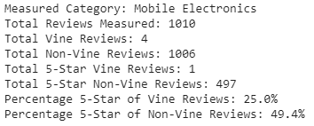

# Amazon Vine-Sponsored Reviews Analysis
## Overview
This analysis uses data describing reviews of a certain category of products on Amazon (specifically, Mobile Electronics) which are either vine-sponsored or non-vine-sponsored. The goal of this analysis is to aggregate this data in a way that will provide insight on whether sponsored reviews are more likely to be 5-star ratings than non-sponsored reviews.

## Results

Above is the output of the final step of the analysis. 

* How many Vine and Non-Vine reviews were there in the category?
    * There were 4 Vine Reviews, and 1006 Non-Vine Reviews in this category.
* How many Vine reviews were 5-stars? How many Non-Vine Reviews were 5-stars?
    * There was 1 5-star Vine Review, and 497 5-star Non-Vine Reviews.
* What percentage of Vine reviews were 5 stars? What percentage of non-Vine reviews were 5 stars?
    * 25% of Vine Reviews were 5 stars, and 49.4% of Non-Vine Reviews were 5 stars.

## Summary
While it may appear based on the above that there is no positivity bias for sponsored ("Vine") reviews, the amount of sponsored reviews is so few (4 / 1006, less than half a percent!) in this category that no definitive conclusion can be drawn. Because we filtered out reviews that had been voted <50% "helpful", there is a possibility that some (potentially overly positive) sponsored reviews were removed from our working data. 

### Additional Analyses Suggestions
* Perform a similar analysis without filtering out "unhelpful" reviews or at least lowering the % helpful cutoff
* Perform a similar analysis using data from multiple product categories
* Perform an analysis comparing the average or median star-rating (instead of the count of 5-star reviews) of Vine and Non-Vine Reviews 